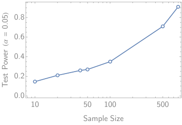

___
Robust and Highly Sensitive Covariate Shift Detection using XGBoost
---
For more information on the method, please refer to the
paper [A Learning Based Hypothesis Test for Harmful Covariate Shift
](https://arxiv.org/abs/2212.02742)
along with the [research codebase](https://github.com/rgklab/detectron).

## Installation

```bash
pip install git+https://github.com/rgklab/detectron_xgb.git
```

## Usage

## Example: Covariate Shift Detection with Synthetic Data

Here we demonstrate the scaling behaviour of detectron xgb on synthetic data.

* We generate a train, validation and test set from a two moon distribution with a small noise parameter.
* We then train an xgboost model on the train set and evaluate it on the test set.
* We then generate an out of distribution test set with a larger noise parameter and evaluate the model on this set.
* We see that the model performs poorly on the out of distribution test set.
* We then use detectron xgb to compute the test power at the 5% significance level for detecting covariate shift in this
  setup.
* We see that the test power increases gracefully with increasing sample size.

```python
# required imports
from sklearn.datasets import make_moons
import pandas as pd
import seaborn as sns
import xgboost as xgb

import detectron_xgb as dxgb
```

Create synthetic datasets.

```python
# generate iid train val and test sets
train = make_moons(n_samples=100, noise=0.15, random_state=0)
val = make_moons(n_samples=100, noise=0.15, random_state=1)
test = make_moons(n_samples=1000, noise=0.15, random_state=2)

# make an ood test set with a larger noise parameter
ood_test = make_moons(n_samples=1000, noise=0.5, random_state=3)
```

Train an XGB model with default parameters

```python
bst = xgb.train(params=dxgb.defaults.XGB_PARAMS,
                dtrain=xgb.DMatrix(*train), num_boost_round=10,
                evals=[(xgb.DMatrix(*val), 'val')], verbose_eval=False)

print(bst.eval(xgb.DMatrix(*test), name='test'))
print(bst.eval(xgb.DMatrix(*ood_test), name='ood_test'))

# [0]	test-auc:0.97003399999999995
# [0]	ood_test-auc:0.86246599999999995
```

Use the `dxgb` benchmarking module to compute the test power for various increasing sample sizes and plot the resulting
power curve.

```python
# compute the test power for various increasing sample sizes
res = []
for sample_size in [10, 20, 40, 50, 100, 200]:
    cal_record = dxgb.benchmarking.detectron_test_statistics(
        train, val, test,
        base_model=bst,
        sample_size=sample_size,
        ensemble_size=4,
    )

    test_record = dxgb.benchmarking.detectron_test_statistics(
        train, val, ood_test,
        base_model=bst,
        sample_size=sample_size,
        ensemble_size=4,
    )

    res.append(dxgb.benchmarking.detectron_dis_power(cal_record, test_record, alpha=0.05, max_ensemble_size=5) | {
        'N': sample_size})

df = pd.DataFrame(res)
sns.lineplot(data=df, x='N', y='power')
```

<p align="center">
  
</p>

## Citation

Please use the following citation if you use this code or methods in your own work.

```bibtex
@inproceedings{
  ginsberg2023a,
  title={A Learning Based Hypothesis Test for Harmful Covariate Shift},
  author={Tom Ginsberg and Zhongyuan Liang and Rahul G Krishnan},
  booktitle={The Eleventh International Conference on Learning Representations },
  year={2023},
  url={https://openreview.net/forum?id=rdfgqiwz7lZ}
}
```