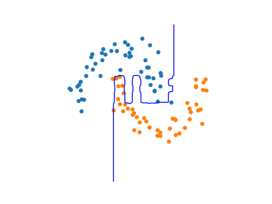

___
Robust and Highly Sensitive Covariate Shift Detection using XGBoost
---
For more information on the method, please refer to the
paper [A Learning Based Hypothesis Test for Harmful Covariate Shift
](https://arxiv.org/abs/2212.02742)
along with the [research codebase](https://github.com/rgklab/detectron).

## Installation

Install the `detectron_xgb` package using pip.

```bash
pip install git+https://github.com/rgklab/detectron_xgb.git
```

## Usage

`detectron_xgb` is separated into a benchmarking and inference module.
The benchmarking module is designed primarily for researchers to benchmark the performance of the method on their own
data.
The inference module is designed for practitioners to use the method in their own applications.
We provide a complete example of each use case below.

### Inference Example: Detecting Covariate Shift in a Production Model

```python
# required imports
import torch
import seaborn as sns
import numpy as np
import xgboost as xgb
import pandas as pd

from detectron_xgb.inference import detectron
```

We start by loading a pretrained xgboost model and data from the rgklab `torch.hub` repository.
This model is trained on the [UCI Heart Disease Data Set](https://archive.ics.uci.edu/ml/datasets/heart+disease) using
only data from the Cleveland Clinic Foundation. However the data also contains patient descriptors from the Hungarian
Institute of Cardiology, Budapest, and the V.A. Medical Center, Long Beach, CA, USA.

**We can use `detectron_xgb` to help decide whether the model is still valid for use on data from these other
institutions.**

```python
# load model and data
model, data = torch.hub.load('rgklab/pretrained_models', 'uci_heart')
```

We simulate the setting where a practitioner has access to an unlabeled observation set from the V.A. Medical Center,
Long Beach, CA, USA consisting of **only 20 samples**.

```python
Q = data['VA Long Beach'][0]
idx = np.random.RandomState(seed=0).permutation(len(Q))[:(N := 20)]
Q = Q[idx]
```

Running `detectron_xgb` is a simple api call that requires only the original train/val/test splits, the pretrained
model, and the observation set.

```python
res = detectron(
    train=data['Cleveland']['train'],
    iid_test=data['Cleveland']['test'],
    val=data['Cleveland']['val'],
    observation_data=Q,
    base_model=model
)
print(res)
# DetectronResult(p_value=0.07, test_statistic=11, baseline=14.64±2.26)
```

`detectron_xgb` assigns a p-value of 7% to the observation set, indicating that the model is likely not valid for use on
data from the V.A. Medical Center, Long Beach, CA, USA. 

We can also try the same experiment with the Hungarian Institute of Cardiology, Budapest data.
Note that the `detectron_xgb` inference model allows us to bypass the costly calibration step by passing in the
calibration record from the previous experiment. This allows this test to run in a fraction of the time.

```python
Q = data['Hungary'][0]
idx = np.random.RandomState(seed=0).permutation(len(Q))[:N]
Q = Q[idx]

res_hungary = detectron(
    train=data['Cleveland']['train'],
    val=data['Cleveland']['val'],
    calibration_record=res.cal_record,
    observation_data=Q,
    base_model=model
)
print(res_hungary)
# DetectronResult(p_value=0.9, test_statistic=17, baseline=14.64±2.26)
```

`detectron_xgb` assigns a p-value of 0.9 to the observation set, indicating that the model is in likely safe to use on
data from the Hungarian Institute of Cardiology, Budapest.

Finally, let's validate the decisions made by `detectron_xgb` by computing the real changes in performance of the
model using labeled data from each institution.

```python
def eval_model(model, data):
    if isinstance(data, dict):
        data = data['test']
    return float(model.eval(xgb.DMatrix(*data)).split(':')[1])


institutions = ['Cleveland', 'Hungary', 'VA Long Beach']
aucs = [eval_model(model, data[name]) for name in institutions]
pd.DataFrame({'AUC': aucs}, index=institutions).T.to_markdown()
```

|          | Cleveland <br/>(Training Domain) | Hungary  | VA Long Beach |
|:---------|:--------------------------------:|:--------:|:-------------:|
| Test AUC |             0.809474             | 0.814825 |   0.665892    |

We see that the model developed in the Cleveland Clinic Foundation is still valid for use on data from the Hungarian
Institute of Cardiology, Budapest, but is not valid for use on data from the V.A. Medical Center, Long Beach, CA.

### Benchmarking Example: Covariate Shift Detection Power Scaling with Synthetic Data

Here we demonstrate the scaling behaviour of `detectron_xgb` on synthetic data.

* We generate a train, validation and test set from a two moon distribution with a small noise parameter.
* We then train an xgboost model on the train set and evaluate it on the test set.
* We then generate an out of distribution test set with a larger noise parameter and evaluate the model on this set.
* We see that the model performs poorly on the out of distribution test set.
* We then use detectron xgb to compute the test power at the 5% significance level for detecting covariate shift in this
  setup.
* We see that the test power increases gracefully with increasing sample size.

```python
# required imports
from sklearn.datasets import make_moons
import pandas as pd
import seaborn as sns
import matplotlib.pyplot as plt
import xgboost as xgb

import detectron_xgb as dxgb
```

Create synthetic datasets.

```python
# generate iid train val and test sets
train = make_moons(n_samples=100, noise=0.15, random_state=0)
val = make_moons(n_samples=100, noise=0.15, random_state=1)
test = make_moons(n_samples=1000, noise=0.15, random_state=2)

# make an ood test set with a larger noise parameter
ood_test = make_moons(n_samples=1000, noise=0.5, random_state=3)
```

Train an XGB model with default parameters

```python
bst = xgb.train(params=dxgb.defaults.XGB_PARAMS,
                dtrain=xgb.DMatrix(*train), num_boost_round=10,
                evals=[(xgb.DMatrix(*val), 'val')], verbose_eval=False)

print(bst.eval(xgb.DMatrix(*test), name='test'))
print(bst.eval(xgb.DMatrix(*ood_test), name='ood_test'))

# [0]	test-auc:0.97003399999999995
# [0]	ood_test-auc:0.86246599999999995
```

Plotting the training dataset as well as the decision boundary of the trained model. We can see that this model 
only represents one possible solution out of many that could fit the training set well.


Use the `dxgb` benchmarking module to compute the test power for various increasing sample sizes and plot the resulting
power curve.

```python
# compute the test power for various increasing sample sizes
res = []
for sample_size in [10, 20, 40, 50, 100, 200]:
    cal_record = dxgb.benchmarking.detectron_test_statistics(
        train, val, test,
        base_model=bst,
        sample_size=sample_size,
        ensemble_size=4,
    )

    test_record = dxgb.benchmarking.detectron_test_statistics(
        train, val, ood_test,
        base_model=bst,
        sample_size=sample_size,
        ensemble_size=4,
    )

    res.append(dxgb.benchmarking.detectron_dis_power(cal_record, test_record, alpha=0.05) | {
        'N': sample_size})

df = pd.DataFrame(res)
```

_Note: the above code is implemented directly in the benchmarking module to provide a simplified API:_

```python
df = detectron_dis_power_curve(
    train, val, test, ood_test,
    sample_sizes=[10, 20, 40, 50, 100, 200],
    alpha=0.05,
    detectron_kwargs={'ensemble_size': 4}
)
```

Plotting the power curve.

```python
sns.lineplot(data=df, x='N', y='power')
plt.xscale('log')
```

<p align="center">
  
</p>

## Citation

Please use the following citation if you use this code or methods in your own work.

```bibtex
@inproceedings{
ginsberg2023a,
    title = {A Learning Based Hypothesis Test for Harmful Covariate Shift},
    author = {Tom Ginsberg and Zhongyuan Liang and Rahul G Krishnan},
    booktitle = {The Eleventh International Conference on Learning Representations },
    year = {2023},
    url = {https://openreview.net/forum?id=rdfgqiwz7lZ}
}
```
